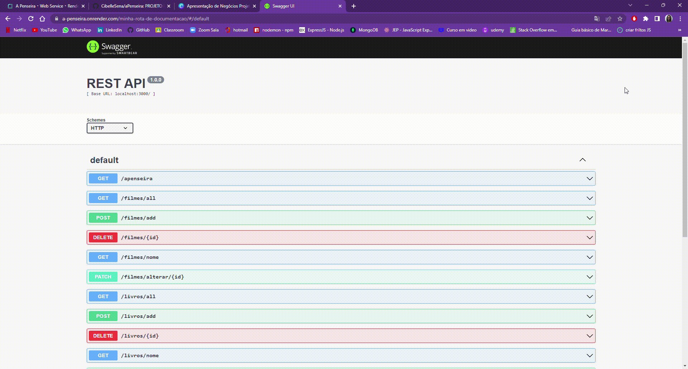

<h1 align="center">A PENSEIRA</h1>


<h1 align="center">
  
<p align="center"><p></h1>

## *Apresentação*
Criei essa API a partir de um desejo da minha mãe, pois foi ela quem me ensinou a anotar e dar estrelas (notas) para cada livro e filme lido/assistido.
Eu anoto desde os meus 15 anos em uma agenda antiga, e ela da mesma forma anota desde a adolescência dela (hoje ela tem 56 anos).

A ideia de chama-la de "A Penseira" partiu do meu amor por Harry Potter e seu mundo, e a Penseira de Dumbledore é o local onde ele armazena seus pensamentos, e nesta minha API irei armazenar os dados de Filmes e Livros ja assistidos ou lidos com a possibilidade de dar notas e deixar meu pensamento sobre cada um.

<h1 align="center">
  
<p align="center"><p>
</h1>

## *Melhorias Futuras*

Irei melhorar esta API ao ponto de compartilhar com outras pessoas, para que usem como indicação de livros/filmes. E que também possam ter o hábito de anotar e compartilhar pois adoro esse tipo de troca.

Quero implementar opções de carregar imagens das capas de filmes e livros e ate mesmo ampliar os metodos de pesquisa.

<br> 

## *Sumário*
- [Apresentação](#apresentação)
- [Funcionalidades](#funcionalidades)
- [Tecnologias, dependências e bibliotecas](#tecnologias-dependências-e-bibliotecas)
- [Arquitetura](#arquitetura)
- [Preparando o ambiente para o projeto](#instruções-para-instalações-no-projeto)
- [Rotas](#rotas)
[Preparando o ambiente para a autenticação](#instruções-para-autenticações-no-projeto)

<br> 

## *Funcionalidades*

- [x] Cadastro de usuário
- [x] Cadastro de Filmes assistidos
- [x] Cadastro de Filmes para assistir
- [x] Cadastro de Livros lidos
- [x] Cadastro de Livros para ler
- [x] Alterar dados de Livros ou filmes e usuários
- [x] Buscar Livros, Filmes ou Usuários pelo Nome
- [x] Deletar cadastro através do ID
- [x] Deletar de Livros ou filmes da lista não assistidos / lidos

<br>

## *Tecnologias e Dependências*

| Ferramenta | Descrição |
| --- | --- |
| `javascript` | Linguagem de programação. |
| `node.js`    | Ambiente de execução do javascript.|
| `express`    | Framework NodeJS. |
| `mongoose`   | Dependência que interage com o MongoDB para a conexão da database, criação do model e das collections.|
| `nodemon`    | Dependência que observa as atualizações realizadas nos documentos para rodar o servidor automaticamente.|
| `npm`| Gerenciador de pacotes.|
| `MongoDb`    | Banco de dados não relacional orientado a documentos.|
| `Mongo Atlas`| Interface gráfica para verificar se os dados foram persistidos.|
| `Postman` | Interface gráfica para realizar os testes.|
| `jsonwebtoken `| Dependência que implementa o protocolo JSON Web Token.|
| `bcrypt`| Bcryptjs é uma biblioteca para encriptação de dados. Neste caso, o dado a ser criptografado é o password.|
| `dotenv`| Dependência  para gerenciar facilmente variáveis de ambiente, não é obrigatório para JWT, mas uma boa prática para configurações em geral.|
| `swagger`| Gera a documentação.|
| `Render`| Hospeda a documentação.|

Link para a documentação:

📝 Você pode visualizar meu Render [aqui](https://a-penseira.onrender.com)

📝 Você pode visualizar meu Swagger [aqui](http://localhost:1313/minha-rota-de-documentacao/#/default)

<h1 align="center">
  
<p align="center"><p></h1>


<br>

## *Arquitetura*

```
 📁A Penseira
   |
   |--📁node_modules
   |
   |--📁 src
   |  ||--📁 Assets
   |  ||--📁 controllers
   |  |    |- 📄 filmesController.js
   |  |    |- 📄 LivrosController.js
   |  |    |- 📄 minhaListaController.js
   |  |    |- 📄 usuariosController.js
   |  |
   |  ||--📁 database
   |  |    |- 📄 dbconnect.js
   |  |
   |  ||--📁 models
   |  |    |- 📄 filmes.js
   |  |    |- 📄 livros.js
   |  |    |- 📄 minhaLista.js
   |  |    |- 📄 usuarios.js
   |  |
   |  ||--📁 routes
   |  |    |- 📄 filmesRoutes.js
   |  |    |- 📄 index.js
   |  |    |- 📄 livrosRoutes.js
   |  |    |- 📄 minhaListaRoutes.js
   |  |    |- 📄 usuariosRoutes.js
   |  |
   |  ||-📄 app.js
   |  |
   |  |--📁 swagger
   |  |   |- 📄 swagger_output.json
   |  |
   |- 📄 .env
   |- 📄 .env.example
   |- 📄 .gitignore
   |- 📄 package-lock.json
   |- 📄 package.json
   |- 📄 README.md
   |- 📄 server.js
   |- 📄 swagger.js
```

<br>

## *Preparando o Ambiente Para o Projeto*

📌 Para executar este projeto, você deverá ter instalado o Node.js e as dependências do npm.
Seguiremos a ordem de instalações no terminal:
- Clone o projeto através do comando:
        `$git clone https://github.com/CibelleSena/`
- `npm init -y`
- `npm install `
- `npm install express `
- `npm install nodemon `
- `npm install mongoose `
- `npm i --save-dev dotenv`
- `npm install jsonwebtoken --save`
- `npm install bcrypt --save`
- `npm install --save-exact jest@28.1.0 --save-dev`
- Inicialize com o comando `npm start` para que você possa executar.

<br>

## *Rotas*

📌 Todas as rotas existentes neste projeto:

| HTTP   | EndPoint Usuários |       Descrição                    | 
| ------ | ------------------| -----------------------------------| 
| GET    | `/usuarios/all`   |  Listar todos usuarios cadastrados |
| POST   | `/usuarios/add`   |  Adicionar um novo usuario     |
| POST   | `/usuarios/login` |  Adicionar um novo usuario     |
| DELETE | `/usuarios/:id`   |  Deverá deletar um usuário pelo ID |
| PATCH  | `/usuarios/alterar/:id` |  Alterar dados de um usuário pelo ID | 
-------------------------------------------------------------------------


| HTTP   | EndPoint Livros |       Descrição                         | 
| ------ | ----------------| ----------------------------------------| 
| GET    | `/livros/all`   |  Listar todos livros                    | 
| POST   | `/livros/add`   |  Adicionar um novo livro lido           |
| DELETE | `/livros/:id`   |  Deverá deletar um livro pelo ID        | 
| GET    | `/livros/nome`  |  Localizar um livro pelo nome           |
| PATCH  | `/livros/alterar/:id` |  Alterar dados de um livro pelo ID |
----------------------------------------------------------------------

| HTTP   | EndPoint Filmes |       Descrição                         | 
| ------ | ----------------| ----------------------------------------|
| GET    | `/filmes/all`    |  Listar todos os filmes         |  
| POST   | `/filmes/add`     |  Adicionar um novo filme assistido | 
| DELETE | `/filmes/:id`   |  Deverá deletar um filme pelo ID    | 
| GET    | `/filmes/nome`  |  Localizar um filme pelo nome |
| PATCH  | `/filmes/alterar/:id`  |  Alterar dados de um filme pelo ID |
---------------------------------------------------------------------------

| HTTP   | EndPoint Minha Lista |       Descrição                         | 
| ------ | ----------------| ----------------------------------------|
| GET    | `/minhalista/all`  |  Listar todos os livros e filmes não assistidos ou lidos |
| POST   | `minhalista/add`|  Adicionar um novo livro ou filme na lista de não assistidos ou lidos | 
| DELETE | `/minhalista/:id` |  Deleta cadastro de filme/livro da lista de não lidos ou não vistos pelo ID |
| GET    | `/minhalista/nome`  |  Localizar cadastro de filme/livro da lista de não lidos ou não vistos pelo nome |
| PATCH  | `/minhalista/alterar/:id`  |  Alterar dados de filme/livro da lista de não lidos ou não vistos pelo ID |
------------------------------------------------------------------------------------------------ 
<br>

## *Preparando o Ambiente Para Autenticação*

📌 Criar arquivo .env (adicionar no .gitignore) e usar o arquivo .env.example como modelo, colocando assim os seus dados.
Seguiremos a ordem de instalações no terminal:
- Inicialize o comando de instalação `npm i express cors` para instalar o cors.
- Inicialize o comando de instalação `npm i --save-dev dotenv` para instalar dontenv.
- Inicialize com o comando `npm start` para que você possa executar.

<br>

## *Contribua para o meu projeto!*
1. Faça o fork do projeto;
2. Crie uma branch para realizar suas alterações: `git checkout -b feature/nome-da-nova-branch`
3. Commit as alterações feitas e abra um pull request

<br>

<h1 align="center">  Obrigada por chegar até aqui!! 
<br>

<br>

<h1 align="center">  *** Quem sou eu ***

<h1 align="center">
  
<p align="center"><p></h1>

Sou a Cibelle , tenho 36 anos, sou mineirinha de BH, mãe do Jorge de 3 anos. Conheci e me apaixonei por Backend atraves de um amigo Dev Senior. Comecei fazendo cursos em plataformas gratuitas na internet, e em um patrocinado conheci a {Reprograma}, e cá estou eu apresentando meu projeto final depois de 18 semanas de muita dedicação.

*Meus contatos:*
- Meu [linkedin](https://www.linkedin.com/in/cibellesena/)
- Meu [github](https://github.com/CibelleSena)


<h1 align="center">
  
<p align="center"><p></h1>